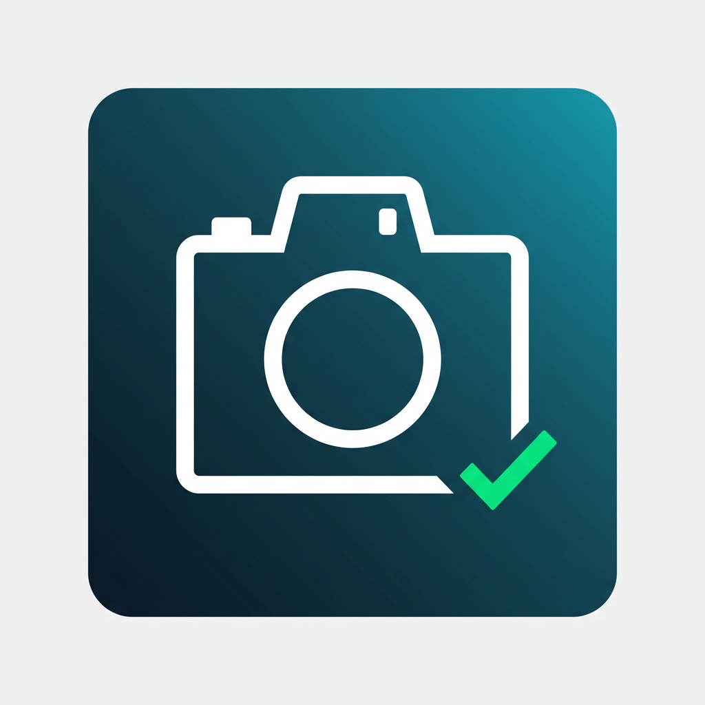
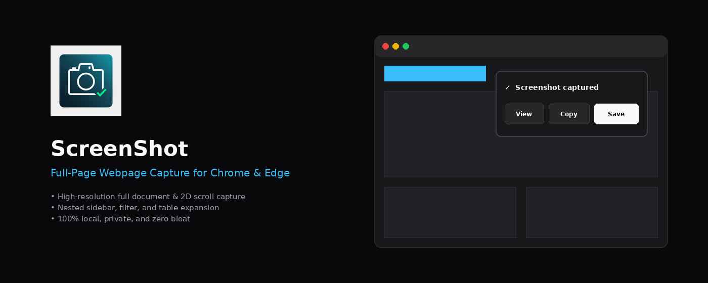
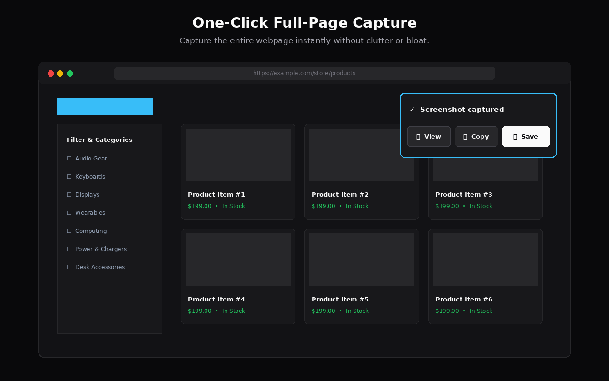
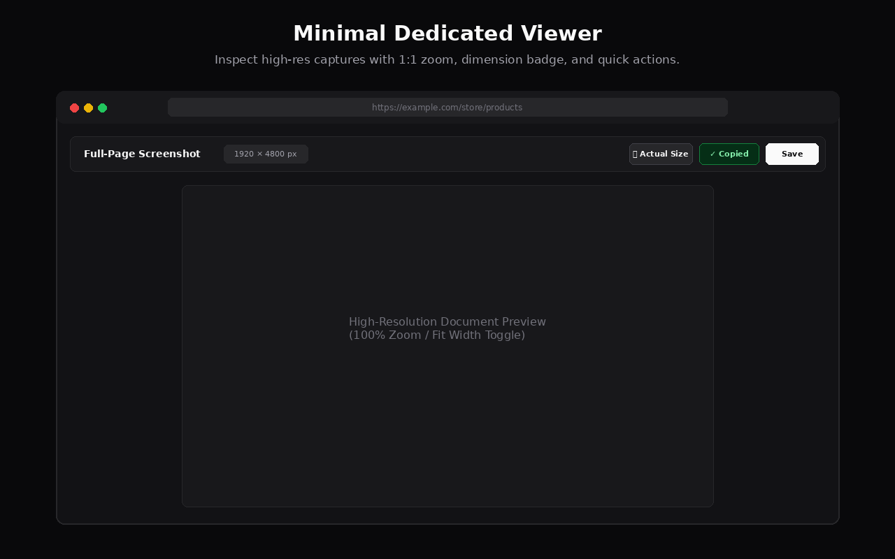
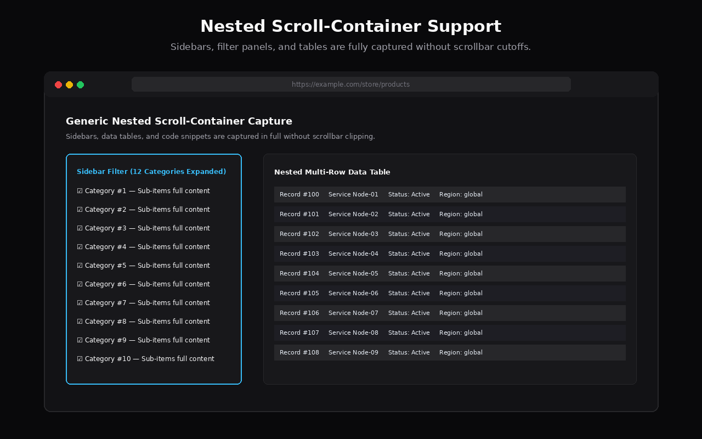
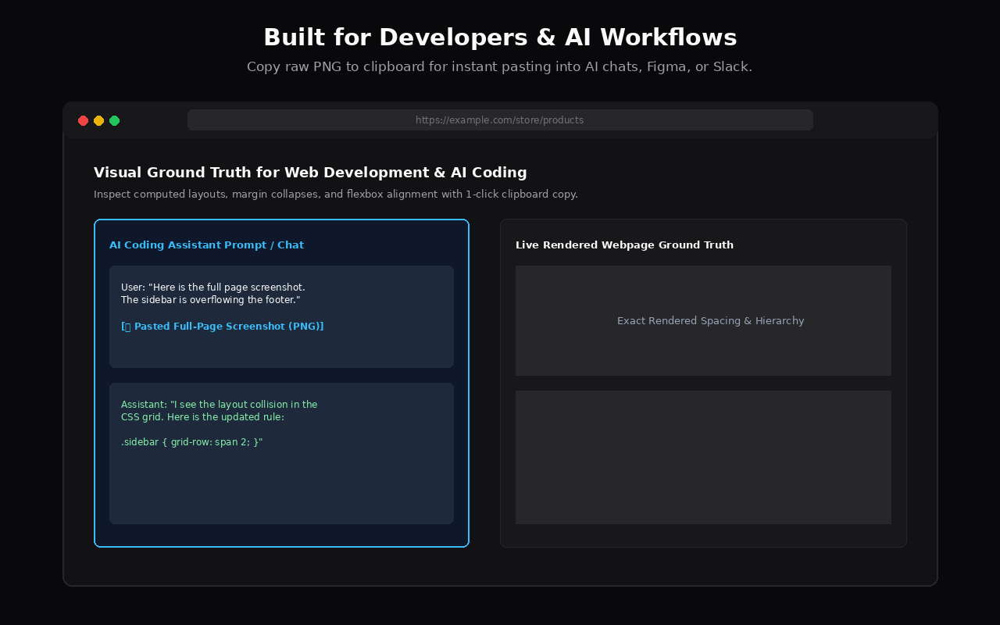

<p align="center">
  
</p>

<h1 align="center">ScreenShot — Full Page Capture</h1>

<p align="center">
  <strong>Simple, free, open-source full-page screenshots for Chrome and Microsoft Edge.</strong><br>
  Built for developers, designers, and AI workflows that need visual ground truth.
</p>

<p align="center">
  <a href="https://github.com/developerasaad/screenshot-extension/releases/latest"></a>
  <a href="LICENSE"></a>
  <a href="PRIVACY.md"></a>
  <a href="https://microsoftedge.microsoft.com/addons"></a>
  <a href="https://chromewebstore.google.com"></a>
</p>

<p align="center">
  
</p>

---

## Why I Built This

I built this because screenshot extensions kept becoming more complicated than the problem they were supposed to solve.

Most screenshot extensions today come with image editors, annotation toolbars, cloud upload prompts, account logins, subscriptions, usage limits, and occasionally tracking or advertisements. 

I just wanted to click a button, capture the complete webpage, and get the actual image.

### The AI-Assisted Web Development Use Case

This becomes especially important when developing websites with AI coding assistants.

When you're building a frontend with an AI agent, the AI can read your HTML, CSS, React components, or Tailwind classes. But source code only describes *how the layout is intended to be built*. It does not guarantee what the browser *actually rendered*.

The live browser environment contains visual reality that is difficult or impossible to infer reliably from source code alone:
- Actual computed spacing and margin collapses
- Element alignment and flexbox wrapping behaviors
- Typography rendering and line wrapping across screen widths
- Overlapping headers or misplaced sticky elements
- Clipping, overflow bugs, and scroll container cutoffs
- Differences between intended design and live CSS cascade

When you encounter a layout issue, giving the AI model a screenshot provides **visual ground truth**:
- *"The category list in the sidebar is getting clipped below the fold."*
- *"The hero text is colliding with the fixed navbar on smaller viewports."*
- *"These three feature cards are misaligned."*
- *"There is unexpected whitespace between the gallery and the footer."*

A full-page screenshot gives the assistant the entire visual context of the rendered page, making visual debugging and UI iteration fast and reliable.

---

## Screenshots

<p align="center">
  
  
</p>

<p align="center">
  
  
</p>

---

## Features

- **Full-Page Capture**: Captures the entire scrollable webpage, including long pages and wide layouts.
- **Nested Scroll Containers**: Automatically detects and captures scrollable sidebars, filter lists, code blocks, chat panels, and data tables.
- **Fixed & Sticky Header Handling**: Captures top navigation headers and floating buttons once at their true position without repeating them on every tile.
- **Horizontal & 2D Overflow**: Captures wide pages with horizontal scrollbars using a coordinate-based 2D capture grid.
- **Three Actions**:
  - **View**: Opens the high-resolution screenshot in a distraction-free viewer with zoom and dimensions.
  - **Save**: Downloads a full-resolution PNG file directly to your downloads folder.
  - **Copy**: Copies the raw PNG image directly to your system clipboard for pasting into chat apps, documents, or AI tools.
- **Zero Distractions**: No progress bars during capture, no floating banners, and no ads.
- **100% Local**: All stitching and processing runs in your browser using `OffscreenCanvas`. No servers, no accounts, and no data collection.

---

## How It Works

Web browsers only allow extensions to capture the *currently visible viewport* via `chrome.tabs.captureVisibleTab()`. To capture a full page:

1. **Page Analysis**: The content script scans the DOM to calculate true scrollable dimensions (`scrollWidth`, `scrollHeight`, viewport dimensions, and device pixel ratio).
2. **Nested Scroller Detection**: Meaningful inner scroll containers (like sidebar filter lists or scrollable tables) are temporarily expanded in memory for capture.
3. **2D Tile Capture**: The extension scrolls the page across a 2D coordinate grid $(X, Y)$, capturing individual viewport tiles in sequence while respecting browser capture rate limits.
4. **Overlay Suppression**: On the initial viewport $(0, 0)$, fixed headers and floating widgets render naturally. On subsequent scroll positions, fixed/sticky elements are temporarily suppressed with `visibility: hidden` so they do not duplicate down the page.
5. **Exact Canvas Stitching**: Tiles are stitched onto an `OffscreenCanvas` using exact document coordinates and physical pixel scaling ($\text{CSS pixels} \times \text{DPR}$).
6. **State Restoration**: The webpage's original scroll position, nested container styles, and overlay visibilities are fully restored in a `finally` block.
7. **Action Dialog**: A minimal, dark-themed result card appears in the top-right corner offering View, Save, or Copy.

For a deeper technical walkthrough, see [ARCHITECTURE.md](docs/ARCHITECTURE.md).

---

## Privacy & Permissions

This extension operates entirely within your local browser. It makes **zero network requests** and transmits **zero data**.

### Manifest Permissions

| Permission | Reason |
| :--- | :--- |
| `activeTab` | Grants temporary access to the active webpage when you click the extension icon to measure and scroll the page. |
| `scripting` | Injects the capture coordinator and the isolated Shadow DOM result dialog. |
| `downloads` | Saves the stitched PNG screenshot to your local machine when you click "Save PNG". |
| `tabs` | Detects when a captured tab is closed or navigated so in-progress capture sessions abort cleanly. |
| `offscreen` | Provides an offscreen document context to write raw PNG blobs to the system clipboard when background fallback is required. |
| `clipboardWrite` | Allows writing the captured PNG image directly to your system clipboard when you click "Copy". |

See [PRIVACY.md](PRIVACY.md) for the complete privacy policy.

---

## Installation

### From Source (Developer Mode)

1. **Clone the repository**:
   ```bash
   git clone https://github.com/developerasaad/screenshot-extension.git
   cd screenshot-extension
   ```

2. **Install dependencies**:
   ```bash
   npm install
   ```

3. **Build the extension**:
   ```bash
   npm run build
   ```
   The compiled extension will be output to the `dist/` directory.

4. **Load into Chrome or Microsoft Edge**:
   - Open **Google Chrome** (`chrome://extensions`) or **Microsoft Edge** (`edge://extensions`).
   - Enable **Developer mode** (toggle in the top-right or left sidebar).
   - Click **Load unpacked**.
   - Select the `dist/` folder inside this repository.

---

## Usage

1. Navigate to any webpage you want to capture.
2. Click the **ScreenShot** icon in your browser toolbar.
3. The extension will scroll and capture the page silently.
4. A card will appear in the top-right corner:
   - Click **Save PNG** to download the image file.
   - Click **Copy** to copy the image to your clipboard.
   - Click **View** to inspect the screenshot in a full-size viewer.

---

## Development

### Available Scripts

- `npm run dev`: Starts Vite in watch mode to automatically rebuild on file changes.
- `npm run build`: Typechecks and creates an optimized production build in `dist/`.
- `npm run typecheck`: Runs TypeScript compiler (`tsc --noEmit`) to verify types.
- `npm run package:chrome`: Builds and packages a ZIP archive for the Chrome Web Store (`release/chrome-extension.zip`).
- `npm run package:edge`: Builds and packages a ZIP archive for Microsoft Edge Add-ons (`release/edge-extension.zip`).
- `npm run package:all`: Builds and packages distribution ZIPs for both stores.

### Repository Layout

```text
├── src/
│   ├── background/       # Service worker coordinating sessions and rate limits
│   ├── capture/          # Coordinate grid math, session state, and canvas stitcher
│   ├── content/          # Page analyzer, nested container expander, Shadow DOM dialog
│   ├── offscreen/        # Offscreen document for background clipboard writes
│   ├── shared/           # Shared TypeScript interfaces, message types, and constants
│   └── viewer/           # Minimal standalone viewer page (HTML/CSS/TS)
├── assets/               # Extension logos, promotional tiles, and screenshots
├── scripts/              # Packaging and asset generation automation scripts
├── public/               # Static assets and manifest.json
└── docs/                 # Architecture, FAQ, and troubleshooting guides
```

---

## Browser Support

- **Google Chrome**: Version 116+ (Manifest V3 support, Offscreen Documents API)
- **Microsoft Edge**: Version 116+ (Chromium-based Manifest V3)
- **Brave / Opera / Vivaldi**: Fully supported (Chromium-based)

---

## Technical Limitations

We believe in being honest about technical constraints:
- **Browser Protected Pages**: Extensions cannot run scripts on `chrome://`, `edge://`, `chrome-extension://`, or the Chrome Web Store / Edge Add-ons galleries due to browser security policies.
- **Cross-Origin iframes**: Due to browser Same-Origin Policy (SOP), cross-origin iframe internals cannot have their internal DOM manipulated or scrolled independently.
- **Extremely Heavy Canvas Pages**: WebGL and `<canvas>` elements that dynamically re-render based on viewport visibility or continuous requestAnimationFrame loops will be captured at their current render state.
- **Browser Canvas Size Limits**: Most Chromium browsers impose a maximum canvas dimension of 16,384 or 32,768 pixels. Pages exceeding these extreme bounds may be constrained by browser memory.

---

## Contributing

Contributions are welcome! Please read [CONTRIBUTING.md](CONTRIBUTING.md) for development guidelines, testing procedures, and code standards.

---

## Documentation

- [Architecture & Capture Engine Deep-Dive](docs/ARCHITECTURE.md)
- [Frequently Asked Questions](docs/FAQ.md)
- [Troubleshooting Guide](docs/TROUBLESHOOTING.md)
- [Changelog](CHANGELOG.md)
- [Privacy Policy](PRIVACY.md)
- [Security Policy](SECURITY.md)
- [Contributing Guidelines](CONTRIBUTING.md)

---

## License

This project is licensed under the [MIT License](LICENSE) — free and open source with no artificial restrictions.
